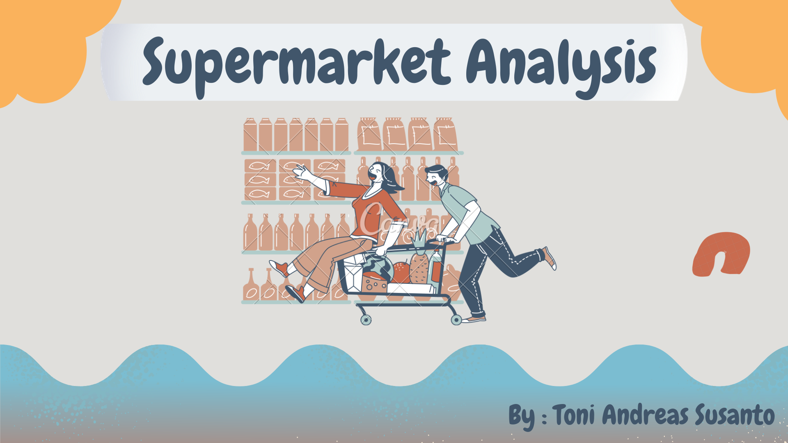

<center>

</center>
    

```{r setup, include=FALSE}
# clear-up the environment
rm(list = ls())

# chunk options
knitr::opts_chunk$set(
  message = FALSE,
  warning = FALSE,
  fig.align = "center",
  comment = "#>"
)

options(scipen = 9999)
```

**Contact :**

<script src="https://kit.fontawesome.com/9427ff0559.js" crossorigin="anonymous"></script>
<a href="https://www.linkedin.com/in/toni-andreas-s"><i class="fa fa-linkedin icon-green" style="font-size:30px;color:#0077b5" title="Find me on Linkedin" ></i>
**linkedin**</a>&nbsp;&nbsp;
<a href="https://api.whatsapp.com/send?phone=6281345771101"><i class="fa fa-whatsapp" style="font-size:30px;color:#128C7E" title="Find me on WhatsApp"></i>
**WhatsApp**</a>

# Introduction {.tabset}

<p style="color: #000000;text-align:justify">
In general, we all have been to supermarkets, whether to buy necessities, travel and so on. Supermarket is a store that sells various kinds of goods. The word supermarket, comes from English which literally means **big market**. Because supermarkets usually sell a wide variety of goods, we tend to need special tools such as the **R** programming language to be able to analyze complex data effectively and efficiently. It is hoped that by analyzing effectively and efficiently, we can obtain useful **insights** in making decisions efficiently and effectively.
</p>

## **Background**

<p style="color: #000000;text-align:justify">
We realize that in the current technological era, we must have added values such as the ability to process data effectively and efficiently. Through this awareness and my interest in learning new things such as the **R** programming language, I tried to make this project. Besides that, this project was structured as a form of practice for me after learning coding skills. 
</p>

## **Purpose**

1. This project aims to improve the writer's understanding and skills in using **R** programming language.

2. Then this project aims to be a means for writers to build a portfolio that is much needed in the professional world.

3. Moreover, I hope to broaden the knowledge and understanding of each reader.


## **Business Question**

<p style="color: #000000;text-align:justify">
The growth of supermarkets in big cities is increasing every year and market competition is also high. We as a data team are asked to **analyze the performance of supermarkets** and **provide recommendations** for our supermarkets. The data that we will use contains transactions during the January - March 2019 period.
</p>

## **Data Introduction**

<p style="color: #000000;text-align:justify">
On this occasion I try to analyze data about supermarkets provided on the [Kaggle](https://www.kaggle.com/aungpyaeap/supermarket-sales) platform, this data consists of 1000 rows and 17 columns. Through the data, I tried to prepare and wrangling the data, then do the exploration and analysis of the data and draw conclusions.
</p>
<p style="color: #000000;text-align:justify">
Our data comes from 3 cities in Myanmar. We can see the location of this city on the following map. Moreover, when we press the city icon, we can see the iconic image of each city.
</p>

```{r}
library(leaflet)

# get icon
ico <- makeIcon(
    iconUrl = "http://1.bp.blogspot.com/-gR-c6n8olqM/UBnRAyS_m-I/AAAAAAAAAQ8/nmOtsS54nUo/s1600/gambar-bendera-myanmar.JPG",
    iconWidth=750/40, iconHeight=499/40)

Latitude = c(17.02460428627904, 19.766060069490056, 21.954434407595635)
Longitude = c(96.22689582916921, 96.08171350599085, 96.08600825781728)

pts <- data.frame(Latitude, Longitude)

file <- "https://www.abouttimemagazine.co.uk/wp-content/uploads/2016/05/Shwedagon.jpg"
file1 <- "https://www.remotelands.com/remotenew1/dist/images/country/myanmar/city/20061701/b200617001.jpg"
file2 <- "https://1.bp.blogspot.com/-Wx6ZIQMlaIA/WRMT5q1V2mI/AAAAAAAADKA/s545x4vTB_ECUS0zyins68dYSx_g9UbUACLcB/s1600/Mandalay.jpg"

leaflet() %>%
  addTiles %>%
  addMarkers(data = pts, lng =~Longitude, lat =~Latitude, icon=ico,
                   popup = c(paste0("Yangon City",""),
                             paste0("Naypyitaw City",""),
                             paste0("Mandalay City","")))
```


# Data Preparation and Wrangling

## Library

```{r}
# ================== Wrangling Data =====================
library(lubridate)
library(tidyr)

# ===================== Scales ===================
library(scales)

# ==================== Visualization =====================
library(glue) # setting tooltip
library(ggplot2)
library(hrbrthemes)
library(plotly)
```

<br>

## Data Preparation

```{r}
supermarket <- read.csv("data_input/supermarket.csv") # read dataset
head(supermarket, 5) # Showing the top 5
```

Column description:

* `Invoice_ID`: Computer generated sales slip invoice identification number
* `Branch`: Branch of supermarket (3 branches are available identified by A, B and C).
* `City`: Location of supermarket
* `Customer_type`: Type of customers, recorded by Members for customers using member card and Normal for without member card.
* `Gender`: Gender type of customer
* `Product_line`:  General item categorization groups - Electronic accessories, Fashion accessories, Food and beverages, Health and beauty, Home and lifestyle, Sports and travel
* `Unit_price`: Price of each product in $
* `Quantity`: Number of products purchased by customer
* `Tax_5.`: tax fee for customer buying
* `Total`: Total price including tax
* `Date`: Date of purchase (Record available from January 2019 to March 2019)
* `Time`: Purchase time (10am to 9pm)
* `Payment`: Payment used by customer for purchase (3 methods are available – Cash, Credit card and Ewallet)
* `cogs`: Cost of goods sold
* `gross_margin_percentage`: Gross margin percentage
* `gross_income`: gross income from product sales
* `Rating`: Customer stratification rating on their overall shopping experience (On a scale of 1 to 10)

<br>

## Data Wrangling

### Checking Missing Value

```{r}
anyNA(supermarket)
```
Does not have a missing value so we can go directly to the next stage.

<br>

### Checking Data Duplication

```{r}
anyDuplicated(supermarket)
```

Does not have duplicated data so we can go directly to the next stage.

<br>

### Deleting Column `Tax_5.`

```{r}
data.frame(supermarket$Tax_5., supermarket$gross_income)[1:7,]
```

<p style="color: #000000;text-align:justify">
We will delete the `Tax.5.` column because I suspect there is an error in the `Tax_5.` column. This column has the same value as `supermarket_gross_income` so I feel it is better to delete the `Tax_5.` column.
</p>

```{r}
supermarket$Tax_5. <- NULL
head(supermarket)
```

<br>

### Customizing the Dataset Type {.tabset}

**Viewing data structure with `str()` before changing**
```{r}
str(supermarket)
```
<br>

#### Factor Type

<p style="color: #000000;text-align:justify">
**First**, we will change some column data types `Branch`, `City`, `Customer_type`, `Gender`, `Product_line`, `Payment` to **factor** data type, this type is intended for data such as categorical. This is because the column has repeated values and aims to save memory that will be used because R does not consider each repeated value as a unique value. Moreover, by converting data into **factor**, it can make it easier for us to perform statistical calculations and others.
</p>

<p style="color: #000000;text-align:justify">
Checking the uniqueness of values from several columns by using the `lapply()` function so that checking the unique values is not done manually.
</p>

```{r}
lapply(X = supermarket[, c("Branch", "City", 
                       "Customer_type", "Gender", 
                       "Product_line", "Payment")],
       FUN = unique)
```

The process of converting into factor type.

```{r}
supermarket[, c("Branch", "City", "Customer_type", 
                "Gender", "Product_line", "Payment")] <- # save the result of data type change
lapply(X = supermarket[, c("Branch", "City", "Customer_type",
                           "Gender", "Product_line", "Payment")],
       FUN = as.factor) # Changing data types at once with the lapply() function
```

#### Time Type
<p style="color: #000000;text-align:justify">
**Second**, we will change the `Date` and `Time` columns to time type. This is intended to make it easier for us to analyze transactions based on time. We will change with the help of the [lubridate](https://www.rdocumentation.org/packages/lubridate/versions/1.8.0) library.
</p>

```{r echo=FALSE}
head(supermarket,3)
```

<p style="color: #000000;text-align:justify">
Kita mengetahui kolom `Date` memiliki susunan MM/DD/YYYY atau bulan-hari-tahun sehingga nantinya akan menggunakan fungsi `mdy()` dan kolom `Time` memiliki susunan hh:mm atau jam-menit sehingga nantinya akan menggunakan fungsi `hms::parse_hm()` dari library `lubridate`. 
</p>

<p style="color: #000000;text-align:justify">
We know the `Date` column has the order `MM/DD/YYYY` or month-day-year so we will use the `mdy()` function and the `Time` column has order `hh:mm` or hour-minute array so we will use the `hms function later: :parse_hm()` from the `lubridate` library.
</p>

```{r}
supermarket$Date <- mdy(supermarket$Date)
supermarket$Time <- hms::parse_hm(supermarket$Time)
```
<br>

###

**Viewing data structure with `str()` after changing**

```{r}
str(supermarket)
```

- Our dataset has 1000 observations (rows) and 16 variables (columns).

- The columns of our dataset already have the appropriate data types:
  
   + Columns with a lot unique values use `character` such as `Invoice_ID`.
   + Columns that have repeated values use `factor` such as (`City`, `Customer_type` etc).
   + Columns related to numbers use `number` such as (`Unit_Price`, `Total` etc).
   + Column related to date using `Date` such as (`Date` etc).
  
<br>

# Data Exploration and Analysis

## Data Summary

```{r}
summary(supermarket)
```

#### 🔎 Summary

1. We have 1000 transactions from `01-Jan-2019` to `30-Mar-2019`.

2. Dominant transactions occur in `Branch` A (340 transactions aka 34% of the total).

3. The highest transaction is in `Product_line` *Fashion accessories* (178 transactions aka 17.8% of the total) and the lowest is in *Health and beauty* (152 transactions aka 15.2%).

4. Transactions that occur as a whole have a `price` range from 10.08 - 99.96 with an average of 55.67 (in dollars).

5. The number of purchases of goods (`Quantity`) in this supermarket ranges from 1 - 10 units with an average of 5.51 (rounded up to 6 units).

6. Total purchases (`Total`) of consumers per transaction are in the range of 10.68 - 1,042.65 with a median of 253.85 (in dollars).

7. Cost of goods sold (`cogs`) per transaction was in the range of 10.17 - 993 and the median was 241.76 (in dollars).

8. Gross income (`gross_income`) per transaction is in the range of 0.5085 - 49.65 with a median of 12,088 (in dollars) and the percentage of gross income margin taken by the company is constant at 4.762%.

9. The `rating` of our 1000 transactions is quite good, 75% of which is numbered more than or equal to 5.5 (based on the first quartile at 5.5) and the median value is 7 out of 10, meaning that 50% of our data has a rating of more than or same 7.

<br>

## Price Distribution

```{r}
box <- 
ggplot(data = supermarket, aes(x = Product_line, y = Unit_price)) +
  geom_boxplot(aes(fill = Product_line)) +
  theme(axis.text.x = element_blank()) +
  labs(title = "Price Distribution on Each Product Line",
       x = "Product Line",
       y = "Price",
       fill = "Product Line : ") +
  theme_dark() +
  theme(axis.text.x = element_blank())
  
ggplotly(box)
```
#### 💡 Insight

The price of each `Product Line` that consumers buy has a ranging from 10 to approximately 99 (in dollars).
  
1. **️Electronic Accessories :** 75% of *Electronic Accessories* consumers buy in the price ranging from 27.85 to 75.91 (in dollars).
     
2. **Fashion Accessories :**  75% of *Fashion Accessories* consumers buy at prices ranging from 35.19 to 81.31 (in dollars).

3. **Food and Beverages :** 75% of *Food and Beverages* consumers buy at prices ranging from 33.33 to 78.88 (in dollars).

4. **Health and Beauty :** 75% of *Health and Beauty* consumers buy at prices ranging from 32.39 to 76.39 (in  dollars).

5. **Home and Lifestyle :** 75% of *Home and Lifestyle* consumers buy at prices ranging from 34.20 to 77.58 (in dollars).

6. **Sports and Travel :** 75% of *Sport and Travel* consumers buy at prices ranging from 34.37 to 80.93 (in dollars).
  
#### 🚀 Recommendation

<p style="color: #000000;text-align:justify">
We recommend that when you want to offer a new product or increase the quantity of supermarket sales, we can consider the dominant price range that consumers buy in each product line.
</p>

<br>

## Gender Distribution

```{r}
# Data Preparation
gdr_produk <- 
as.data.frame(table(supermarket$Product_line, supermarket$Gender))
akm_t <- aggregate(Freq ~ Var1, data = gdr_produk, FUN = sum)

# visualization
bar <- 
ggplot(data = gdr_produk, aes(x = Freq, 
                              y = reorder(Var1, Freq),
                              text = paste("Value is", round(x = (Freq/akm_t$Freq)*100, digits = 2), "%"))) +
  geom_col(aes(fill = Var2), position = "fill") +
  scale_fill_brewer(palette = "Set2") +
   labs(title = "Gender Comparison in Each Product Line",
        x = "Proportion",
        y = NULL,
        fill = "Gender :")

ggplotly(bar, tooltip = "text")
```

#### 💡 Insight

<p style="color: #000000;text-align:justify">
➔ Transactions on the `Electornic Accessories` and `Home and Lifestyle` product lines tend to have a fairly *balanced gender proportion*.
</p>

<p style="color: #000000;text-align:justify">
➔ Transactions on the `Fashion Accessories`, `Food and Beverages` and `Sport and Travel` product lines tend to be dominated by gender *Female*.
</p>

<p style="color: #000000;text-align:justify">
➔ Transactions on the `Health and Beauty` product line tend to be dominated by the gender *Male*.
</p>

#### 📃 Essence

<p style="color: #000000;text-align:justify">
Each product line has a various distribution, there is a balanced gender proportion, more dominant *Female* and more dominant *Male*
</p>

<br>

## Consumer Type Distribution

```{r}
# Data Preparation
pd_cc <- 
as.data.frame(table(supermarket$Product_line, supermarket$Customer_type))

akm_t <- aggregate(Freq ~ Var1, data = pd_cc, FUN = sum)

# visualization
bar1 <- 
ggplot(data = pd_cc, aes(x = Freq, 
                         y = reorder(Var1, Freq),
                         text = paste("Value is", round(x = (Freq/akm_t$Freq)*100, digits = 2), "%"))) +
  geom_col(aes(fill = Var2), position = "fill") +
  scale_fill_brewer(palette = "Set1") +
  labs(title = "Comparison of Consumer Types in Each Product Line",
        x = "Proportion",
        y = NULL,
        fill = "Consumer Types :") 

ggplotly(bar1, tooltip = "text")
```

#### 💡 Insight

<p style="color: #000000;text-align:justify">
➔ In the product line `Fashion Accessories`, `Electronic Accessories`, and `Health and Beauty`, transactions are dominated by Normal type consumers.
</p>

<p style="color: #000000;text-align:justify">
➔ In the `Food and Beverages`, `Sport and Travel`, and `Home and Lifestyle` product lines, transactions are dominated by Member type consumers.
</p>

#### 🚀 Recommendation 

<p style="color: #000000;text-align:justify">
➔ We recommend encourage Normal type consumers to become Members when purchasing products in the `Fashion Accessories`, `Electornic Accessories`, and `Health and Beauty` products.
</p>

<p style="color: #000000;text-align:justify">
➔ In addition, we also continue to push for the other three product lines to continue to increase the proportion of consumers who
member type.
</p>

<p style="color: #000000;text-align:justify">
➔ The hope is that by increasing the proportion of Member-type consumers, it will increase the sense of loyalty and make it easier to promote new products and so on. This can be done by providing attractive benefits for members of the consumer type, etc.
</p>

<br>

## Distribution of Number of Transactions Per Hour

```{r}
# Create hour column (Feature Engineering)
supermarket$hour <- hour(supermarket$Time)

# data preparation
tran_hour <- 
aggregate(Invoice_ID ~ hour + Product_line,
          data = supermarket,
          FUN = length)

# visualization
p <- 
ggplot(tran_hour, aes(x = hour, 
                      y = Product_line, 
                      text = glue(
                              "Product Line : {Product_line}
                              Hour : {hour}
                              Number of Transactions : {Invoice_ID}
                              "))) +
  geom_tile(aes(fill = Invoice_ID)) +
  labs(title = "Distribution of Transaction Amount from Each Product Line and Hour",
       x = "Hour",
       y = NULL,
       fill = "Range") +
  scale_fill_gradient(low="red", high="black") +
  scale_x_continuous(breaks = seq(0,24,1))

ggplotly(p, tooltip="text")
```
#### 💡 Insight

<p style="color: #000000;text-align:justify">
The highest number of transactions is at 19 o'clock on the `Food and Beverages` product line, which is 26 transactions and the lowest transaction is at 20 pm on the `Sport and travel` product line, which is 4 transactions.
</p>

➔ In the `Sports and Travel`, a lot of transactions occurs at 13, 16 and 19.

➔ In the `Home and Lifestyle`, a lot of transactions occurs at 11, 13 and 15.

➔ In the `Health and Beauty`, a lot of transactions occurs at 10, 13 and 14.

➔ In the `Food and Beverages`, a lot of transactions occurs at 10, 15, 19 and 20.

➔ In the `Fashion Accessories`, a lot of transactions occurs at 12, 13, 18 and 19.

➔ In the `Electronic Accessories`, a lot of transactions occurs at 10, 11 and 18.

#### 🚀 Recommendation

<p style="color: #000000;text-align:justify">
➔ By knowing the dominant hours of transactions, we can optimize total sales through efforts to increase the quantity of goods sold during these dominant hours by providing promotions and so on.
</p>

<p style="color: #000000;text-align:justify">
➔ We can also provide special attractive promos at hours when there are less transactions, thereby increasing the number of transactions during those hours.
</p>

<br>


## Dominant and Minimal Product Line Purchased

```{r}
# Data Preparation
vs <- as.data.frame(table(supermarket$Product_line, supermarket$Branch))

# visualization
ggplot(data = vs, mapping = aes(x = Var2, y = Freq)) +
  geom_col(aes(fill = Var1), position = "dodge") +
  geom_label(aes(label = Freq, group=Var1),
             position = position_dodge(width = 0.9),
             vjust = 1.2) +
  labs(title = "Number of Transactions by Product Line in Each Branch",
       subtitle = "Accumulated Transactions from Jan - Mar 2019",
       x = "Branch",
       y = "Number of Transactions",
       fill = "Product Line"
  ) +
   theme(plot.title.position = "plot")
```

```{r}
vs
```


#### 💡 Insight
<p style="color: #000000;text-align:justify">
➔ The `Health and Beauty` product line tends to always occupy the bottom three positions in each branch.
</p>

<p style="color: #000000;text-align:justify">
➔ Branch A tends to be dominated by the `Home and Lifestyle` product line.
</p>

<p style="color: #000000;text-align:justify">
➔ Branch B tends to be dominated by the `Fashion Accessories` and `Sporth and Travel` product lines.
</p>

<p style="color: #000000;text-align:justify">
➔ Branch C tends to be dominated by `Food and Beverages` and `Fashion Accessories` product lines.
</p>

#### 🚀 Recommendation 

<p style="color: #000000;text-align:justify">
We recommend that we need to find out further why the `Health and Beauty` product line has a small number of transactions by looking at whether the marketing team has carried out their duties properly or the problem is with low consumer interest or something else. If there is a problem with the marketing team, it can be fixed such as increasing the effectiveness of promotions, etc. and if the problem is in the lack of consumer interest, then it can be done by providing education so that he is interested in buying the `Health and Beauty` product line.
</p>

<p style="color: #000000;text-align:justify">
Because of branches have different dominant product lines, each branch manager can collaborate with each other to increase overall sales in each branch.
</p>

<br>

## Sales of Each Product Line

```{r}
# data preparation
tl_agg <- aggregate(Total ~ Product_line, data = supermarket, FUN = sum)

# visualization
ggplot(data = tl_agg, aes(x = Total, y = reorder(Product_line, Total))) +
         geom_col(aes(fill = Total), show.legend = FALSE) +
         scale_fill_continuous(low = "red", high = "black") +
         geom_label(aes(label=Total), hjust = 0.8) +
         labs(title = "Total Sales of Each Product Line from the Entire Supermarket",
              subtitle = "Accumulated from Jan - Mar 2019",
              y = NULL,
              x = "Value of Total Sales") +
         scale_x_continuous(labels = scales::comma) +
         theme(plot.title.position = "plot") +
  theme(panel.background = element_rect(fill = '#F5F5F5', color = 'black'))
```

#### 💡 Insight

<p style="color: #000000;text-align:justify">
➔ Overall, the `Food and Beverages` product line has the highest total sales and the `Health and Beauty` product line has the lowest total sales.
</p>

<p style="color: #000000;text-align:justify">
➔ In the previous insigt, we saw that the `Fashion Accessories` product line had the dominant number of transactions in several branches, this is in line with the fact that the `Fashion Accessories` product line has the highest number of transactions among other product lines, namely 178 or 17.8% of the total transactions. However, the sales value of `Fashion Accessories` tends to be in the 4th position out of 6, this is because the price of the products purchased by the transaction is relatively cheaper, so that it affects the total sales which is low, aka even though the quantity is large, the price is relatively cheaper.
</p>

#### 🚀 Recommendation 

<p style="color: #000000;text-align:justify">
➔ We recommend that we need to find the cause of the `Health and Beauty` product line having the lowest total sales and then find a solution like the previous recommendation.
</p>

<p style="color: #000000;text-align:justify">
➔ Then we need to increase the sales value of the `Fashion Accessories` product line.
</p>

<p style="color: #000000;text-align:justify">
➔ Overall, we need to continue to maintain and on the one hand continue to encourage the improvement of our product line by improving marketing, customer satisfaction and so on.
</p>

<br>

## Rating Distribution

```{r}
# Visualization
hist1 <- ggplot(data = supermarket, aes(x = Rating, fill = Branch, 
                                  
                                          )) + 
   geom_histogram(bins = 4, 
                  color = "darkred"
                  ) +
   facet_wrap(~Branch) + 
   labs(title = "Distribution of Consumer Ratings of Each Branch",
        x = 'Rating',
        y = 'Frequency') +
  theme_dark() 

ggplotly(hist1)
```

#### 💡 Insight

<p style="color: #000000;text-align:justify">
➔ These three branches (A, B and C) tend to be dominated by consumers who give a rating of 5 - 9 out of 10.
</p>

<p style="color: #000000;text-align:justify">
➔ In Branch A, the number of consumers who gave a rating of 4 with 10 has the similar value.
</p>

<p style="color: #000000;text-align:justify">
➔ In Branch B, the number of consumers who gave a rating of 4 tends to be more than that of a rating of 10.
</p>

<p style="color: #000000;text-align:justify">
➔ In Branch C, the number of consumers who gave a rating of 4 tends to be less than that of a rating of 10.
</p>

#### 🚀 Recommendation 

<p style="color: #000000;text-align:justify">
We tend to have to increase our customer satisfaction, this can be reflected in a decrease in the number of ratings 4 and an increase in rating 10. The solution can be in the form of being friendly to consumers, a clean atmosphere and so on.
</p.

<br>

## Sales Trend

```{r}

# Create week column (Feature Engineering)
supermarket$week <-  week(supermarket$Date)

# data preparation
total_trend <- aggregate(Total ~  week + Branch, data = supermarket, FUN = sum)


# visualization 
plt <- 
ggplot(data = total_trend, aes(x = week, y = round(Total, 2), group = Branch, col = Branch,
                                      text = paste("Branch ", Branch,
                                      "<br>Week - ", week,
                                      "<br>Sales: $", round(Total/1000,2),"K"))) +
  geom_line() +
  geom_point() +
  labs(
    title = "Trend of Total Sales From Each Branch",
    subtitle = "Period Jan - Mar 2019 (Week 1 - 13)",
    x = "Week",
    y = "Total sales (in $)") +
  scale_x_continuous(breaks = seq(1,13,1)) +
  scale_y_continuous(breaks = seq(0,12000,1000), labels = unit_format(scale = 10e-4, suffix = "K")) +
  scale_color_manual(values = c("black", "darkgrey", "red")) +
  theme(legend.position = "top",
        plot.title.position = "plot") 

ggplotly(plt, tooltip = "text")
```

#### 💡 Insight

Notes : `K = 000`

<p style="color: #000000;text-align:justify">
➔ Branch A tends to have a very fluctuating trend, with the highest value in the 3rd week of 11.9K and the lowest at the 13th week of 6.2K.
</p>

<p style="color: #000000;text-align:justify">
➔ Branch B tends to have a very fluctuating trend, with the highest value in the 4th week of 11.97K and the lowest at the 13th week of 5.08K.
</p>

<p style="color: #000000;text-align:justify">
➔ Branch C tends to have a very fluctuating trend, with the highest value in the 6th week of 12.05K and the lowest at the 13th week of 4.33K.
</p>

#### 🚀 Recommendation

<p style="color: #000000;text-align:justify">
Should have to build a more stable income and strive for sales next week must be higher than the previous week.
</p>

<br>

## Crowded Day of Consumers

```{r}
# Create day column
supermarket$day <- wday(supermarket$Date, label = T, abbr = F)

# data preparation
agg_data <- aggregate(Invoice_ID ~ day + Branch, data = supermarket, FUN = length)

# visualization
plt <- 
ggplot(data = agg_data, aes(x = day, y = Invoice_ID, group = Branch, col = Branch,
                            text = glue(
                              "Branch : {Branch}
                              Day : {day}
                              Number of Transactions : {Invoice_ID}
                              ")
                            )) +
  geom_line() +
  geom_point() +
  labs(title = "Trend of Number of Transactions Per Name Day in Each Branch",
       x = "Day",
       y = "Number of Transactions")
ggplotly(plt, tooltip = "text")
```

#### 💡Insight 

<p style="color: #000000;text-align:justify">
➔ Branch A has the highest number of transactions on Sunday and the lowest on Wednesday.
</p>

<p style="color: #000000;text-align:justify">
➔ Branch B has the highest number of transactions on Saturday and the lowest on Sunday.
</p>

<p style="color: #000000;text-align:justify">
➔ Branch C has the highest number of transactions on Tuesday, Saturday and the lowest on Monday, Friday.
</p>

#### 📃 Essence 

<p style="color: #000000;text-align:justify">
We can see the pattern generated in the chart above tends to after selling down drastically the next day it will start to rise again until it reaches a peak and then declines again. 
</p>

<br>

## Three Cities Performance 

Based on 3 Indicators : `Gross Income`, `Amount of Transactions` and `Quantity`

```{r}
# Collect columns containing the total quantity and gross income of each city
data_agg <- aggregate.data.frame(list(Quantity = supermarket$Quantity,
                                      Gross_Income = supermarket$gross_income),
                                by = list(city = supermarket$City),
                                FUN = sum)

# Collect the transaction amount of each city
transaction <- aggregate(supermarket$City,
                       by = list(supermarket$City), 
                       FUN = length)

# Get transaction amount column for data_agg
data_agg$Number_of_Transactions <- transaction$x

# transform data wide -> long
city_pivot <- pivot_longer(data = data_agg, 
                           cols = c("Quantity", "Gross_Income","Number_of_Transactions"))
                             
# Visualization
ggplot(data = city_pivot, aes(x = city, y = value)) +
  geom_col(aes(fill = city), position = "dodge") +
  facet_wrap(~name, scales = "free_y") +
  labs(title = "Three Cities Performance Based on 3 Indicators",
       subtitle = "From January to March 2019",
       x = NULL,
       y = "Value",
       fill = "City :") +
  theme(axis.text.x = element_blank())
```

#### 💡 Insight

<p style="color: #000000;text-align:justify">
➔ with the **Gross Income** indicator, the city of `Naypyitaw` tends to have the highest score.
</p>

<p style="color: #000000;text-align:justify">
➔ With the **Number of Transactions** indicator, the city of `Yangon` tends to have the highest value.
</p>

<p style="color: #000000;text-align:justify">
➔ with the **Quantity** indicator, the city `Yangon` tends to have the highest score.
</p>

#### 📃 Essence

<p style="color: #000000;text-align:justify">
The city of `Yangon` is indeed superior in two of the three indicators but the City of `Naypyitaw` tends to be the most profitable city. So the best city performance can be `Yangon` or `Naypyitaw` depending on which considerations you want to prioritize.
</p>

<br>

## The Combined Performance of All Supermarkets

```{r}
# Create month column
supermarket$month <- month(supermarket$Date, label = T, abbr = F)

# data preparation
df_agg <- aggregate.data.frame(list(Total= supermarket$Total,
                          COGS = supermarket$cogs,
                          Gross_Income = supermarket$gross_income),
                     by = list(month = supermarket$month), 
                     FUN = sum)

df_agg <- pivot_longer(data = df_agg,
                       cols = c("Total", "COGS", "Gross_Income"),
                       names_to = "component")


# Visualization
plot_col <- 
ggplot(data = df_agg, aes(x = month, y = value,
                          text = paste("Month :", month, "\n",
                                       "Component :", component,"\n",
                                       "Nilai $ :", round(value/1000,2), "K"))) +
  geom_col(aes(fill = component), position = "dodge") +
  labs(title = " Trend Total, COGS dan Gross Income\n From Jan - Mar 2019",
       x = NULL,
       y = "Value $") +
   scale_y_continuous(labels = unit_format(scale = 10e-4, suffix = "K")) +
   theme_minimal()
  

  
ggplotly(plot_col, tooltip = "text") 
```
#### 💡 Insight 

<p style="color: #000000;text-align:justify">
➔ The total sales of our supermarkets decreased in February 2019 compared to January 2019. However, the following month (March 2019) began to experience a recovery with an increase in total sales although it had not returned to the total sales figures in January 2019.
</p>

<p style="color: #000000;text-align:justify">
➔ The previous pattern of total sales was similar to the pattern of cost of goods sold (COGS) and gross revenue, which decreased in February 2019 compared to January 2019 and recovered in March 2019 although not yet to the figure in January 2019.
</p>

#### 🚀 Recommendation 

<p style="color: #000000;text-align:justify">
We must encourage sales growth every month so that gross income can be increased. Moreover, we must also seek efficiency in cost of goods sold (COGS) or increase the percentage of gross income per sale in order to increase gross income.
</p>

<br>
<br>

# Conclusion

<p style="color: #000000;text-align:justify">
➔ In this project, various things have been reviewed. Starting from the Introduction which contains the beginning and introduction of what will be discussed in this project.
</p>
<p style="color: #000000;text-align:justify">
➔ Then we have also discussed the stages of data preparation and wrangling which contains preparing the data and adjusting the data so that it can be processed.
</p>
<p style="color: #000000;text-align:justify">
➔ After that, discuss the exploration and analysis of data containing descriptions of transactions that occur such as gender and type of consumers, prices of goods, etc. Then we also try to analyze supermarket performance based on `Rating`, `Product line`, `Branch`, `Total sales`, `COGS`, and `Gross Income`. We also discuss supermarket performance with respect to time such as which hours and weeks have the highest transactions.
</p>
<p style="color: #000000;text-align:justify">
➔ We have also analyzed the related insights, recommendations or essence of each graph that has been created.
</p>
<p style="color: #000000;text-align:justify">
Overall, the supermarkets that we discuss in this project are good, as can be seen from the positive `Gross Income`, having various product diversification, good customer satisfaction (the rating is dominated by high scores). However, there is still a note to maintain stable growth in Gross Income and other measures. We also have to boost the performance of the `Health and Beauty` product line which is in the lowest position compared to other product lines. I rate the overall performance of this supermarket 8 out of 10.
</p>