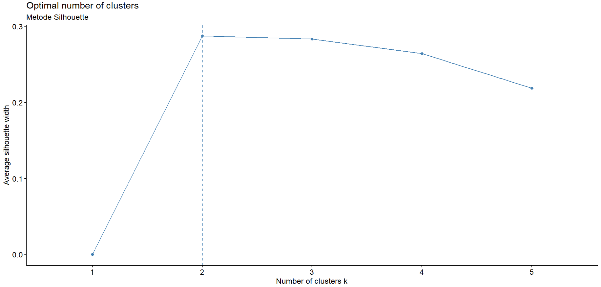

```{r setup, include=FALSE}
# clear-up the environment
rm(list = ls())

# chunk options
knitr::opts_chunk$set(
  message = FALSE,
  warning = FALSE,
  fig.align = "center",
  comment = "#>"
)

options(scipen = 999)
```

<style>
body {
text-align: justify}
</style>

# Pendahuluan  {.tabset}

## Apa itu Clustering ?

Clustering adalah salah satu teknik Machine Learning, yang memiliki kemampuan untuk mengelompokkan kumpulan data yang tidak berlabel. Setiap data yang tidak berlabel nantinya akan diklasifikasikan ke dalam kelompok tertentu dimana, titik data yang berada dalam kelompok yang sama akan memiliki sifat atau fitur yang serupa, sedangkan titik data dalam kelompok yang berbeda diharapkan memiliki sifat atau fitur yang sangat berbeda.

Dalam ilmu data, kita dapat menggunakan clustering untuk mendapatkan beberapa wawasan berharga dari data kita dengan melihat hasil pengelompokan yang terjadi. Informasi yang berharga tersebut bisa kita bawa untuk membantu dalam menentukan segmentasi market, segmentasi customer, *social netwrok analysis*, dan masih pengelompokan negara dan masih banyak lagi. 


## Kenapa Machine Learning ?

Kita telah mengetahui bahwa clustering merupakan pengelompokan data-data yang memiliki banyak manfaat. Pengelompokan data ini dapat berdasarkan benua, GDP perkapita, tingkat Inflasi dll. Pada kasus clustering yang hanya melibatkan sedikit faktor seperti tingkat Inflasi saja, kita dapat dengan mudah mengelompokan mereka misal inflasi ringan, moderat, tinggi dan hyperinflasi. Namun, pada kasus yang melibatkan informasi banyak misal ada tingkat Inflasi, exports, imports, GDP perkapita dll, cenderung kita sulit mengelompokannya secara efektif dan efisien.

Pada realitasnya, sering kali setiap orang atau negara memiliki informasi yang sangat banyak dan berbeda-beda sehingga akan memakan waktu dalam menganalisis hal tersebut secara manual. Selain itu, banyaknya informasi tersebut akan menambah kesulitan atau kerumitan dalam memproses pengelompokan data (clustering). Oleh karena itu, dibutuhkan *Machine Learning* agar dapat memproses pengelompokan data (clustering) secara efektif dan efisien.


## Permasalahan Bisnis

PT Sarana Motor Jaya Tbk. merupakan perusahaan otomotif motor dari Indonesia. Ia ingin melakukan penjualan berbagai produknya di berbagai negara. Perusahaan ingin mengetahui karakteristik produk seperti apa yang diminati setiap kelompok negara. Perusahaan juga ingin memaksimumkan profit dari penjualan global oleh karena itu perlu menyelaraskan harga penjualan dan kemampuan masyarakat dalam membeli motor. Jadi kita sebagai Data Scientist di minta untuk mengelompokkan setiap negara berdasarkan faktor sosial-ekonomi dan kesehatan yang menentukan tingkat kemajuan negara secara keseluruhan. Berikut data yang digunakan untuk menyelesaikan permasalahan bisnis ini, [Kaggel](https://www.kaggle.com/datasets/rohan0301/unsupervised-learning-on-country-data).


# Persiapan dan Wrangling Data

## Pustaka

```{r}
library(tidyverse)
library(factoextra)
library(ggiraphExtra)
```

## Membaca Dataset

```{r}
df_country <- read.csv("Country-data.csv")
df_country
```

Deskripsi kolom :

- `country` : Nama negara.
- `child_mort` : Kematian anak di bawah usia 5 tahun per 1000 kelahiran hidup.
- `exports` : Ekspor barang dan jasa per kapita.
- `health` : Total pengeluaran kesehatan per kapita.
- `imports` : Import barang dan jasa per kapita.
- `income` : Pendapatan bersih per orang.
- `inflation` : Tingkat kenaikan harga barang dan jasa (inflasi) selama satu tahun.
- `life_expec` : Rata-rata jumlah tahun anak yang baru lahir akan hidup jika pola kematian saat ini tetap sama. 
- `total_fer` : Jumlah anak yang akan dilahirkan setiap wanita jika tingkat kesuburan usia saat ini tetap sama.
- `gdpp` : Nilai PDB per kapita.


## Mengecek Nilai Hilang

```{r}
anyNA(df_country)
```
> Tidak terdapat nilai hilang sehingga dapat lanjut ke tahap selanjutnya.

## Mengecek Duplikasi Data

```{r}
anyDuplicated(df_country)
```
> Tidak terdapat data yang terduplikasi sehingga dapat lanjut ke tahap selanjutnya.

## Wrangling Dataset

Menjadikan kolom nama negara (`country`) menjadi nama atau identitas baris. Kemudian menghapus kolom `country` karena sudah menjadi identitas baris.

```{r}
rownames(df_country) <- df_country$country
df_country <- df_country %>% select(-country)
```


# Eksplorasi Data Analisis

```{r}
summary(df_country)
```

**📈 Insight :** 

- Nilai kolom `child_mort` didominasi (75%) dari rentang 2.60 hingga 62.10 dengan tertinggi di angka 208 

- Nilai kolom `exports` didominasi (75%) dari rentang 0.109 hingga 51.350 dengan tertinggi di angka 200 

- Nilai kolom `health` didominasi (75%) dari rentang 1.810 hingga 8.60 dengan tertinggi di angka 17.90 

- Nilai kolom `imports` didominasi (75%) dari rentang 0.06 hingga 62.10 dengan tertinggi di angka 208 

- Nilai kolom `income` didominasi (75%) dari rentang 609 hingga 22,800 dengan tertinggi di angka 125,000 

- Nilai kolom `inflation` didominasi (75%) dari rentang -4,210 hingga 10,750 dengan tertinggi di angka 104 

- Nilai kolom `life_expec` didominasi (75%) dari rentang 32.10 hingga 76.80 dengan tertinggi di angka 82.80 

- Nilai kolom `total_fer` didominasi (75%) dari rentang 1.150 hingga 3.880 dengan tertinggi di angka 7.490 

- Nilai kolom `gdpp` didominasi (75%) dari rentang 231 hingga 14,050 dengan tertinggi di angka 105,000. 


# PCA

PCA (*Principal Component Analysis*) adalah suatu metode mereduksi dimensi dengan menggunakan beberapa garis/bidang. PCA merangkum informasi (*variance*) dari variabel-variabel awal menggunakan dimensi-dimensi baru yang disebut principal component (PC). Seringkali melalui PCA ini akan diambil beberapa PC saja yang merangkum jumlah informasi yang dibutuhkan sehingga dapat meringankan komputasi.

## Proses PCA

```{r}
pca <- prcomp(x = df_country, scale. = TRUE)
```

## Kontribusi Setiap PC 

```{r}
summary(pca)
```

Keterangan:

- Proportion of Variance: informasi yang ditangkap oleh tiap PC
- Cumulative Proportion: jumlah informasi yang ditangkap secara kumulatif dari PC1 hingga PC tersebut

**📈 Insight :** 

- PC1 merupakan komponen yang paling besar menangkap informasi yaitu 45.96% dari data kita.
- Ternyata kita dapat mengurangi 4 kolom dan informasi yang berkurang hanya sekitar 5.5% saja karena PC5 memiliki Cumulative Proportion = 0.9453. 


```{r}
# melihat variansi yang dirangkum tiap PC (plot)
plot(pca,
     xlab = "PC1 hingga PC9",
     main = "Kontribusi Setiap PC")
```
**📈 Insight :**

- Terlihat PC1 cenderung menangkap informasi yang terbanyak banyak (sebesar 45.96%);
- Kemudian PC2 cenderung menangkap informasi sebesar 17.18;
- Lalu PC 3 cenderung menangkap informasi 13% dan seterusnya. 

## PC 1 (Kontribusi Setiap Variabel)

```{r}
fviz_contrib(
X = pca, #model PCA
choice = "var", #menampilkan variable contribution
axes = 1 #mengacu pada PC ke-1
)
```

**📈 Insight :** 

> Pada PC dimensi 1, variabel yang paling berkontribusi adalah `life_expec`, `child_mort`, `total_fer`, `income` dan `gdpp`.


## PC 2 (Kontribusi Setiap Variabel)

```{r}
fviz_contrib(
X = pca, #model PCA
choice = "var", #menampilkan variable contribution
axes = 2 #mengacu pada PC ke-2
)
```

**📈 Insight :** 

> Pada PC dimensi 2, variabel yang paling berkontribusi adalah `imports` dan `exports`.


## PC 3 (Kontribusi Setiap Variabel)

```{r}
fviz_contrib(
X = pca, #model PCA
choice = "var", #menampilkan variable contribution
axes = 3 #mengacu pada PC ke-3
)
```

**📈 Insight :** 

> Pada PC dimensi 1, variabel yang paling berkontribusi adalah `inflation` dan `health`.


## PC 4 (Kontribusi Setiap Variabel)

```{r}
fviz_contrib(
X = pca, #model PCA
choice = "var", #menampilkan variable contribution
axes = 4 #mengacu pada PC ke-4
)
```

**📈 Insight :** 

> Pada PC dimensi 4, variabel yang paling berkontribusi adalah `gdpp`, `health`, `income`,  `total_fer` dan `child_mort`.


## PC 5 (Kontribusi Setiap Variabel)

```{r}
fviz_contrib(
X = pca, #model PCA
choice = "var", #menampilkan variable contribution
axes = 5 #mengacu pada PC ke-4
)
```

**📈 Insight :** 

> Pada PC dimensi 4, variabel yang paling berkontribusi adalah `inflation` dan `health`.


## Analisis Top 10 Negara Berdasarkan GDP Perkapita

```{r}
gdpp10 <- df_country %>% arrange(-gdpp) %>% head(10)
gdpp10
```

```{r}
pca_gdpp10 <- prcomp(x = gdpp10, scale. = TRUE)
```

```{r}
# make a visualization using `biplot()`
biplot(x=pca_gdpp10, cex = 0.5,
choices = c(1,2)) #menampilkan PC sesuai kebutuhan by default akan menampilkan PC1 dan PC2
```

**📈 Insight :** 

- Negara `Switzerland`, `Ireland`, `Netherlands` dan `Sweden` memiliki karakteristik serupa yaitu memiliki nilai tinggi pada variabel `life_expec`, dan `health`.
- Negara `Luxembourg` cenderung memiliki nilai `gdpp`, `exports` dan `imports` yang relatif paling tinggi.
- Negara `United States` cenderung memiliki nilai `health` dan `total_fer` yang relatif paling tinggi
- Negara `Denmark` dan `Australia` memiliki nilai `health` dan `total_fer` yang relatif serupa.
- Negara `Norway` cenderung memiliki nilai `gdpp`, `income`, `inflation`, dan `child_mort` yang hampir sama besar.
- Negara `Qatar` cenderung memiliki nilai `income`, `inflation` dan `child_mort` yang relatif paling tinggi.

*Perbandingan ini berdasarkan PC1 dan PC2 saja.*


## Analisis 10 Negara Terbawah Berdasarkan GDP Perkapita

```{r}
gdpp10_bw <- df_country %>% arrange(gdpp) %>% head(10)
gdpp10_bw
```

```{r}
pca_gdpp10_bw <- prcomp(x = gdpp10_bw, scale. = TRUE)
```

```{r}
# make a visualization using `biplot()`
biplot(x=pca_gdpp10_bw, cex = 0.5,
choices = c(1,2)) #menampilkan PC sesuai kebutuhan by default akan menampilkan PC1 dan PC2
```

**📈 Insight :** 

- Negara `Eritrea` dan `Madagascar` cenderung memiliki nilai `income` dan`life_expec` relatif paling tinggi.
- Negara `Liberia` cenderung memiliki nilai `life_expec` dan `imports` yang tinggi.
- Negara `Mozambique`, `Malawi` dan `Sierra Leone` memiliki karakteristik serupa yaitu memiliki nilai tinggi pada variabel `gdpp`, dan `child_mort`.
- Negara `Niger` dan `Congo, Dem. Rep.` memiliki karakteristik serupa yaitu memiliki nilai tinggi pada variabel `total_fer`, `exports` dan `health`.
- Negara `Burundi` cenderung memiliki nilai `health` dan`imports` relatif tinggi.
- Negara `Liberia` cenderung memiliki nilai `life_expec` dan `imports` relatif paling tinggi. 

*Perbandingan ini berdasarkan PC1 dan PC2 saja.*


# K-Means Clustering

Clustering bertujuan untuk menghasilkan cluster dimana:

- Observasi di 1 cluster yang sama yang memiliki karakteristik yang mirip
- Observasi dari cluster yang berbeda memiliki karakteristik yang berbeda

K-means merupakan salah satu algoritma yang bersifat unsupervised learning. K-means adalah *centroid-based clustering algorithms*. Centroid adalah titik pusat. 

K-means merupakan proses yang berulang dari:

1. Random initialization: meletakkan k centroid secara random.
2. Cluster assignment: assign masing-masing observasi ke cluster terdekat, berdasarkan perhitungan jarak.
3. Centroid update: menggeser centroid ke rata-rata (means) dari cluster yang terbentuk.
4. Ulangi langkah 2 dan 3 sampai tidak ada observasi yang clusternya berubah lagi.


## Melakukan Skala Dataset

Perlu membuat data memiliki skala yang sama karena data kita memiliki range nilai yang sangat berbeda, ada yang puluhan hingga ratusan ribu. 

```{r}
df_country_scale <- scale(df_country)
```

## Menentukan K Optimum

### 1. Metode Elbow

Dengan metode pertama ini kita akan memvariasikan jumlah kelompok dengan menghitung *Within Cluster Sum of Square (WSS)*. WSS adalah hasil jumlah kuadrat jarak antara setiap observasi terhadap titik *centroid* (titik pusat data) untuk setiap kemungkinan jumlah kelompok.

Fungsi `fviz_nbclust`() secara otomatis akan menghitung WSS sampai dengan 10 kelompok (jumlah kelompok yang ingin dicoba hitung bisa diatur secara manual sesuai dengan kebutuhan).

Dengan bertambahnya jumlah kelompok, nilai WCSS akan mulai berkurang (nilai WCSS terbesar ketika K = 1). Ketika kita menganalisis grafik kita dapat melihat bahwa grafik akan berubah dengan cepat pada suatu titik dan dengan demikian menciptakan bentuk siku. Dari titik ini, grafik mulai bergerak hampir sejajar dengan sumbu X. Nilai K yang sesuai dengan titik ini adalah nilai K optimal atau jumlah kelompok yang optimal.

```{r}
set.seed(123)
elbow <- 
fviz_nbclust(
  x = df_country_scale,
  FUNcluster = kmeans,
  method = "wss",
  k.max = 5
) + labs(subtitle = "Metode Elbow")
```

```{r, fig.dim = c(8, 6)}
elbow
```


> Berdasarkan Metode Elbow, K yang dapat kita pilih adalah 2 atau 3 karena sudah mulai terjadi penurunan yang kurang signifikan.


### 2. Metode Silhoutte

Metode kedua yang bisa dicoba untuk menentukan jumlah kelompok yang optimal adalah *Silhouette Method*. Metode ini akan menghitung seberapa mirip sebuah observasi dengan kelompoknya sendiri jika dibandingkan dengan nilai kelompok lainnya.

Hasil dari perhitungannya akan memiliki rentan koefisien dari -1 sampai 1. Jika nanti hasilnya makin mendekati 1 maka observasi tersebut cocok dengan kelompoknya dan kurang cocok dengan kelompok tetangga, begitu juga sebaliknya, jika hasilnya makin mendekati -1 maka observasi tersebut tidak cocok dengan kelompoknya akan tetapi lebih cocok dengan kelompok tetangganya.

Berbeda dengan elbow method, makin bertambahnya jumlah kelompok, nilai hasil perhitungan *silhouette method* tidak pasti akan berkurang. Penentuan nilai kelompok yang optimal akan ditentukan berdasarkan nilai koefisien paling tinggi pada saat membagi keseluruhan observasi ke berapa banyak kelompok.


```{r}
set.seed(123)
 
silhouette <- 
fviz_nbclust(
  x = df_country_scale,
  FUNcluster = kmeans,
  method = "silhouette",
  k.max = 5
) + labs(subtitle = "Metode Silhouette")
```

```
silhouette
```
```{r echo=FALSE, out.extra=TRUE}

```


> Berdasarkan Metode Silhouette, K yang dapat kita pilih adalah 2 karena memiliki nilai koefisien yang paling mendekati satu alias observasi tersebut cocok dengan kelompoknya dan kurang cocok dengan kelompok tetangga.

### K Optimum

> Jadi K yang dipilih untuk membentuk cluster adalah 2.

## Proses Clustering

```{r}
# k-means with 2 clusters
RNGkind(sample.kind = "Rounding")
set.seed(100) #untuk mengunci ke-random-an proses k-means
clus_country <-  kmeans(df_country_scale, centers = 2)
```

## Hasil Clustering

Jumlah Data di Setiap Cluster :

```{r}
clus_country$size
```


Cluster Setiap Negara : 

```{r}
# Membuat Objek dari Data Awal
hasil <- df_country

# Menambahkan informasi cluster
hasil$cluster <- clus_country$cluster
hasil
```


## Profil Cluster (*Cluster Profiling*)

### 1. Melihat Gambaran Setiap Cluster

#### Cluster 1

```{r}
hasil[hasil$cluster==1,]
```

#### Cluster 2

```{r}
hasil[hasil$cluster==2,]
```

### 2. Melakukan Grouping

Melakukan grouping berdasarkan cluster yang terbentuk, untuk mengetahui karakter dari masing-masing cluster.

```{r}
hasil_mean <- 
hasil %>% 
  group_by(cluster) %>% 
  summarise_all(mean)
hasil_mean
```

**📈 Insight :** 

- Pada Cluster 1 cenderung memiliki nilai rata-rata tinggi pada variabel `child_mort`, `inflation`, dan `total_fer`.
- Pada Cluster 2 cenderung memiliki nilai rata-rata tinggi pada variabel `exports`, `health`, `imports`, `income`, `life_expec`, `gdpp`.


### 3. Melakukan Visualisasi

Pada visualisasi ini telah disesuaikan sehingga dapat tergambar semua variabel.

```{r}
ggRadar(
  data=hasil,
  mapping = aes(colours = cluster),
  interactive = T,
  legend.title = "Group",
  legend.position = "bottom")
```

Notes : Semakin mendekati tulisan nama variabel maka semakin tinggi nilainya.

**📈 Insight :** 

- Pada cluster 1 cenderung memiliki nilai lebih tinggi pada variabel `child_mort`, `inflation`, dan `total_fer`.
- Pada cluster 2 cenderung memiliki nilai lebih tinggi pada variabel `exports`, `health`, `imports`, `income`, `life_expec`, `gdpp`.


### 4. Rangking Cluster

```{r}
# optional: mempermudah profiling
# menampilkan cluster dengan nilai terendah dan tertinggi untuk masing-masing karakteristik whisky
hasil_mean %>%
  pivot_longer(-cluster, names_to = "Variabel") %>%
  group_by(Variabel) %>%
  summarize(`Kelompok Min` = which.min(value),
            `Kelompok Max` = which.max(value))
```

**📈 Insight :** 

- Cluster 1, menjadi kelompok maximum alias tinggi pada variabel `child_mort`, `inflation`, dan `total_fer`.
- Cluster 2, menjadi kelompok maximum alias tinggi pada variabel `exports`, `health`, `imports`, `income`, `life_expec`, `gdpp`.

### 5. Interpretasi 

Cluster 1 

+ Karakteristik --> Besar pada variabel : 

  - `child_mort` : Artinya negara pada cluster 1 cenderung memiliki angka kematian anak yang tinggi.
  - `inflation` : Artinya negara pada cluster 1 cenderung memiliki tingkat inflasi yang tinggi.
  - `total_fer`. Artinya negara pada cluster 1 cenderung memiliki angka kelahiran yang tinggi.

+ Label Cluster : Jadi dapat ditarik kesimpulan bahwa cluster 1 merupakan negara belum maju. 

Cluster 2

+ Karakteristik --> Besar pada variabel : 

  - `exports` : Artinya negara pada cluster 2 cenderung memiliki export barang dan jasa yang tinggi.
  - `health` : Artinya negara pada cluster 2 cenderung memiliki pengeluaran kesehatan yang tinggi.
  - `imports` : Artinya negara pada cluster 2 cenderung memiliki import barang dan jasa yang tinggi.
  - `income` : Artinya negara pada cluster 2 cenderung memiliki pendapatan bersih yang tinggi.
  - `life_expec` : Artinya negara pada cluster 2 cenderung memiliki rata-rata harapan hidup yang tinggi.
  - `gdpp` : Artinya negara pada cluster 2 cenderung memiliki nilai PDB perkapita yang tinggi.

+ Label Cluster : Jadi dapat ditarik kesimpulan bahwa cluster 2 merupakan negara maju. 

# Clustering Menggunakan Hasil PCA

## Menentukan PC

```{r}
summary(pca)
```
> Kita akan mengambil dari PC1 hingga PC5 karena dapat mengurangi 4 dimensi serta sudah menangkap informasi sebnayk 94.53%.

## Mengambil PC1 - PC5

```{r}
df_pc1_5 <- as.data.frame(pca$x)[,1:5]
df_pc1_5
```

## Menentukan K Optimum

### 1. Metode Elbow

```{r}
set.seed(123)
elbow_pc <- 
fviz_nbclust(
  x = df_pc1_5,
  FUNcluster = kmeans,
  method = "wss",
  k.max = 5
) + labs(subtitle = "Metode Elbow")
```

```{r}
elbow_pc
```


> Berdasarkan Metode Elbow, K yang dapat kita pilih adalah 2 atau 3 karena sudah mulai terjadi penurunan yang kurang signifikan.


### 2. Metode Silhoutte


```{r}
set.seed(123)

silhouette_pc <- 
fviz_nbclust(
  x = df_pc1_5,
  FUNcluster = kmeans,
  method = "silhouette",
  k.max = 5
) + labs(subtitle = "Metode Silhouette")
```

```{r}
silhouette_pc
```


> Berdasarkan Metode Silhouette, K yang dapat kita pilih adalah 3 karena memiliki nilai koefisien yang paling mendekati satu alias observasi tersebut cocok dengan kelompoknya dan kurang cocok dengan kelompok tetangga.

### K Optimum

> Jadi K yang dipilih untuk membentuk cluster adalah 3.

## Proses Clustering

```{r}
# k-means with 3 clusters
RNGkind(sample.kind = "Rounding")
set.seed(100) #untuk mengunci ke-random-an proses k-means
clus_pc <-  kmeans(df_pc1_5, centers = 3)
```

## Hasil Clustering

Jumlah Data di Setiap Cluster :

```{r}
clus_pc$size
```

Cenderung kita sulit melihat nilai antar PC karena merupakan nilai yang telah diskalakan. Oleh karena itu, saya melakukan subsetting dengan memasukan nama cluster pada data awal.
 
Cluster Setiap Negara : 

```{r}
# Membuat Objek dari Data Awal
hasil_pc <- df_country

# Menambahkan informasi cluster
hasil_pc$cluster <- clus_country$cluster
hasil_pc
```


## Profil Cluster (*Cluster Profiling*)

### 1. Melihat Gambaran Setiap Cluster

#### Cluster 1

```{r}
hasil_pc[hasil_pc$cluster==1,]
```

#### Cluster 2

```{r}
hasil_pc[hasil_pc$cluster==2,]
```

#### Cluster 3

```{r}
hasil_pc[hasil_pc$cluster==3,]
```

### 2. Melakukan Grouping dan Interpretasi

Melakukan grouping berdasarkan cluster yang terbentuk, untuk mengetahui karakter dari masing-masing cluster.

```{r}
hasil_pc_mean <- 
hasil_pc %>% 
  group_by(cluster) %>% 
  summarise_if(is.numeric, funs(mean))

hasil_pc_mean
```

**📈 Insight :** 

Cluster 1

+ Karakteristik 

**Tinggi pada variabel :** 

  - `child_mort` : Artinya cenderung memiliki angka kematian anak yang tinggi.
  - `inflation` : Artinya enderung memiliki tingkat inflasi yang tinggi.
  - `total_fer`. Artinya cenderung memiliki angka kelahiran yang tinggi.
  
**Rendah pada variabel :** 

  - `exports` : Artinya cenderung memiliki export barang dan jasa yang rendah
  - `health` : Artinya cenderung memiliki pengeluaran kesehatan yang rendah
  - `imports` : Artinya cenderung memiliki import barang dan jasa yang rendah
  - `income` : Artinya cenderung memiliki pendapatan bersih yang rendah
  - `life_expec` : Artinya cenderung memiliki rata-rata harapan hidup yang rendah
  - `gdpp` : Artinya cenderung memiliki nilai PDB perkapita yang rendah

+ Label Cluster :  Jadi dapat ditarik kesimpulan bahwa cluster 1 merupakan negara **belum maju** karena memiliki angka kematian anak dan kelahiran yang tinggi alias sarana dan akses kesehatan belum memadai. Selain itu, variabel lain seperti hubungan luar negeri (exports-imports), pengeluaran kesehatan, GDP perkapita dan lain sebagainya masih rendah.


Cluster 2

+ Karakteristik 
  
  - Tinggi pada variabel `health` : Artinya negara pada cluster 2 cenderung memiliki pengeluaran kesehatan yang tinggi.
  - Selain variabel `health`, cenderung memiliki urutan rangking tengah-tegah, sehingga tidak tertinggi atau terendah.
  
+ Label Cluster : Jadi dapat ditarik kesimpulan bahwa cluster 2 merupakan **negara maju** karena tingkat pengeluaran kesehatan tinggi dan variabel lain relatif tetap tinggi dibandingkan cluster 1. 


Cluster 3

+ Karakteristik 

**Tinggi pada variabel :**
  
  - `exports` : Artinya cenderung memiliki export barang dan jasa yang tinggi.
  - `imports` : Artinya cenderung memiliki import barang dan jasa yang tinggi. 
  - `income` : Artinya cenderung memiliki pendapatan bersih yang tinggi.
  - `life_expec` : Artinya cenderung memiliki rata-rata harapan hidup yang tinggi.
  - `gdpp` : Artinya cenderung memiliki nilai PDB perkapita yang tinggi.
  
**Rendah pada variabel :**

  - `child_mort` : Artinya cenderung memiliki angka kematian anak yang rendah.
  - `inflation` : Artinya enderung memiliki tingkat inflasi yang rendah.
  - `total_fer` : Artinya cenderung memiliki angka kelahiran yang rendah.
  
+ Label Cluster :  Jadi dapat ditarik kesimpulan bahwa cluster 3 merupakan **negara sangat maju dan terbuka** karena memiliki income, angka harapan hidup dan GDP perkapita yang tinggi, serta memiliki nilai exports - imports sangat tinggi. Selain itu, angka kematian anak, tingkat inflasi dan angka kelahiran relatif rendah.


# Rekomendasi 

Pada clustering langsung (Tidak menggunakan nilai PCA) dan clustering menggunakan nilai PCA cenderung memiliki pengelompokan data yang serupa. Tetapi pada clustering menggunakan nilai PCA cenderung memiliki tambahan satu buah cluster yang berisi 3 negara yang relatif sangat maju dan terbuka. 

**Cluster 1** (Pada Clustering Langsung dan Clustering Menggunakan Nilai PCA)

- Sebaiknya jangan menjual produk yang mahal karena cenderung negaranya belum begitu maju (sangat sensitif terhadap harga). 
- Usahakan menawarkan produk yang lebih memiliki nilai fungsional secara praktis dari pada nilai fungsional terkini.
- Perlu berhati-hati dalam menetapkan harga jual karena cenderung negara pada cluster 1 memiliki tingkat inflasi yang tinggi sehingga ketika sejak semula menjual terlalu murah, kedepan sulit menyesuaikan dengan kenaikan inflasi karena sangat sensitif terhadap kenaikan harga.

**Cluster 2** (Pada Clustering Langsung dan Clustering Menggunakan Nilai PCA)

- Sebaiknya menjual produk yang menekankan nilai pembeda (barang unik) sehingga dapat mengoptimalkan harga penjualan karena relatif masyarakatnya memiliki pendapatan besar.
- Usahakan menawarkan produk yang bukan hanya memiliki nilai fungsional secara praktis tetapi juga nilai terkini (tren saat ini).
- Usahakan menjual produk dengan mendorong isu ramah lingkungan karena masyarakatnya sangat peduli terkait kesehatan (kebersihan lingkungan). 


**Cluster 3** (Clustering Menggunakan Nilai PCA) 

- Sebaiknya menjual produk yang menekankan nilai mewah (menaikan kelas sosial).
- Usahakan menawarkan produk yang memiliki nilai terkini (tren saat ini) dan nilai benefit yang sangat tinggi karena relatif masyarakatnya mampu membeli.
- Usahakan menjual produk dengan mendorong isu ramah lingkungan karena masyarakatnya sangat peduli terkait kesehatan (kebersihan lingkungan). 
 
# Kesimpulan 

Kita telah melalui berbagai proses dalam pembuatan *Machine Learning* yang dapat mengelompokan data pada beberapa kelompok. Mulai dari persiapan, wrangling dan eksplorasi data. Kemudian mencoba dua hal utama yaitu PCA (*Principal Component Analysis*) yang mereduksi dimensi (kolom) data dan Clustering dengan K-Means yang mengelompokkan data berdasarkan kedekatan antar data. Selain itu, kita juga telah melakukan interpretasi terhadap data, PCA dan Clustering serta memberikan rekomendasi berdasarkan hasil clustering. Harapannya melalui projek ini dapat menjadi referensi dalam membangun *Machine Learning* untuk melakukan pengelompokan (clustering) data sehingga dapat menjadi dasar dalam pengambilan keputusan secara efektif dan efisien. Sekian terima kasih banyak yang telah melihat projek ini. Saya juga menyukai masukan dan kolaborasi sehingga apabila ada masukan, saran, kritik atau untuk berkolaborasi dapat menghubungi lewat [Linkedin](https://www.linkedin.com/in/toni-andreas-s).
