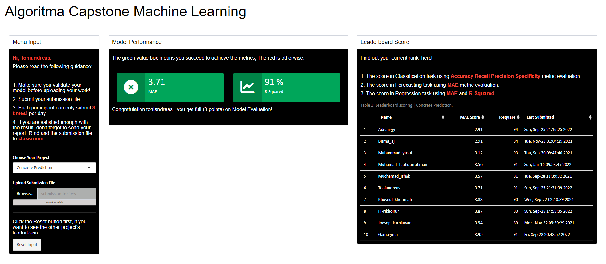

```{r setup, include=FALSE}
# clear-up the environment
rm(list = ls())

# chunk options
knitr::opts_chunk$set(
  message = FALSE,
  warning = FALSE,
  fig.align = "center",
  comment = "#>"
)

options(scipen = 999)
```

<style>
body {
text-align: justify}
</style>


# Library

```{r}
library(tidyverse)
library(GGally)
library(randomForest)
library(caret)
library(lime)
```

# Read Dataset

```{r}
train <- read.csv("data/data-train.csv", row.names = "id")
train
```

# Data Preprocess dan Exploratory


## 1. Mengecek Missing Value

```{r}
is.na(train) %>% colSums()
```

> Tidak Terdapat Missing Value Sehingga dapat melanjutkan step selanjutnya/

## 2. Mengecek Duplikasi Data

```{r}
anyDuplicated(train) 
```

Terdapat data terduplikasi sehingga kita akan menghapus data terduplikasi tersebut.

```{r}
train <- train %>% distinct()
```


## 3. Outlier

A. Melihat dengan plot :

```{r}
boxplot(train)
```

Terlihat 6 kolom yang memiliki nilai outlier.

Kolom ini terdiri dari :

- `slag`
- `water`
- `super_plash`
- `fine_agg`
- `age`

Untuk kolom `strength` sebaiknya nilainya outliernya tidak dibuang karena kolom target.

B. Menemukan nilai outlier dengan `$out`

```{r}
boxplot(train$cement, plot = FALSE)$out
boxplot(train$flyash, plot = FALSE)$out
boxplot(train$coarse_agg, plot = FALSE)$out
```

```{r}
boxplot(train$slag, plot = FALSE)$out
boxplot(train$water, plot = FALSE)$out
boxplot(train$super_plast, plot = FALSE)$out
boxplot(train$fine_agg, plot = FALSE)$out
boxplot(train$age, plot = FALSE)$out
```

> Terlihat kolom yang kita lihat melalui plot sebelumnya terbukti memiliki nilai outlier.

C. Membuang nilai outlier

```{r}
out1 <- boxplot(train$slag, plot = FALSE)$out
out2 <- boxplot(train$water, plot = FALSE)$out
out3 <- boxplot(train$super_plast, plot = FALSE)$out
out4 <- boxplot(train$fine_agg, plot = FALSE)$out
out5 <- boxplot(train$age, plot = FALSE)$out
```

```{r}
train_clean <- 
train %>% filter(
  slag != out1,
  water != out2,
  super_plast != out3,
  fine_agg != out4,
  age != out5
)
```

## 4. Melihat Struktur Data

```{r}
glimpse(train_clean)
```

> Terlihat setiap kolom sudah memiliki tipe yang sesuai.

## 5. Ringkasan Dataset

```{r}
summary(train_clean)
```

> Terlihat data kita memiliki rentang yang berbeda-beda, ada yang memiliki minimal 0 ataupun ratusan.

## 6. Scaling Dataset

Terlihat pada ringkasan sebelumnya setiap kolom memiliki rentang yang berbeda. Sehingga alangkah lebih baik kita mempersiapkan object data yang telah di scale. Kemudian nanti kita uji apakah data yang discale berpengaruh pada model kita.

```{r}
train_scale <- scale(train_clean) %>% as.data.frame()
```

```{r}
train_scale %>% head() 
```

## 7. Hubungan Antara Feature dan Target

```{r}
ggcorr(train_clean,label=T,label_size = 4)
```

- Terlihat kolom `age` memiliki korelasi positif sedang dengan kolom `strength`. Hal ini dapat dimaknai bahwa umur yang panjang berkaitan dengan kekuatan beton yang tinggi pula (*searah*).
- Terlihat kolom `super_plast` memiliki korelasi linear positif sedang dengan kolom `strength`. Hal ini dapat dimaknai bahwa Jumlah Superplasticizer (Kg) yang banyak berkaitan dengan kekuatan beton yang tinggi pula (*searah*).
- Terlihat kolom `cement` memiliki korelasi positif kuat dengan kolom `strength`. Hal ini dapat dimaknai bahwa jumlah semen yang banyak berkaitan dengan kekuatan beton yang tinggi pula (*searah*).
- Terlihat kolom `water` memiliki korelasi negatif sedang dengan kolom `strength`. Hal ini dapat dimaknai bahwa semakin banyaknya jumlah air berkaitan dengan melemahnya keuatan beton (*berlawanan*). 
- Selain itu kolom lainnya memiliki korelasi lemah seperti `fine_agg`, `coarse_agg`, `flaysh` (korelasi negatif) dan `slag` (korelasi positif).


# Model Fitting and Evaluation

## 1. Cross Validation 

### Data Train

```{r}
# set.seed
RNGkind(sample.kind = "Rounding")
set.seed(100)

# sample split
index <- sample(nrow(train),
                nrow(train)*0.9)

data_train <- train[index,]
data_validation <- train[-index,]
```

```{r}
prop_train <- nrow(data_train)/nrow(train) * 100
prop_validation <- nrow(data_validation)/nrow(train) * 100

data.frame(data = c("Training", "Validation"),
           Proporsi = c(prop_train, prop_validation))
```

### Data Train Scale

```{r}
# set.seed
RNGkind(sample.kind = "Rounding")
set.seed(100)

# sample split
index <- sample(nrow(train_scale),
                nrow(train_scale)*0.9)

data_train_scale <- train_scale[index,]
data_validation_scale <- train_scale[-index,]
```

```{r}
prop_train <- nrow(data_train_scale)/nrow(train_scale) * 100
prop_validation <- nrow(data_validation_scale)/nrow(train_scale) * 100

data.frame(data = c("Training", "Validation"),
           Proporsi = c(prop_train, prop_validation))
```

> Kita membagi dataset dengan perbandingan 90:10. Katakanlah kita bulatkan menjadi 90% untuk training dan 10% untuk testing. Komposisi ini dipilih karena dirasa cukup 10% untuk memvalidasi model dan sisanya untuk menemukan pola data (modeling).

## 2. Fitting and Evaluate Regression Linear

Kita menggunakan model Regression Linear karena merupakan model basic yang cocok untuk menjadi percobaan awal.

### Data Split

```{r}
model_lm <- lm(formula = strength ~. , data = data_train)
summary(model_lm)
```

```{r}
# stepwise regression: backward elimination
model_backward <- step(object = model_lm,  #object diisi dengan model
                       direction = "backward", #menggunakan backward
                       trace = F) #memilih untuk tidak melihat prosesnya
summary(model_backward)
```

Mencoba memprediksi menggunakan model `model_backward`.

```{r}
pred_lm <- predict(model_backward, data_validation)
```

> Kalau kita bandingan nilai **Adjusted R-squared**, cenderung `model_backward` relatif sama baik dengan `model_lm` alias dengan menggunakan *step wise regression relatif* tidak meningkatkan *goodness of fit* alias nilainya tetap karena prediktor yang digunakan tetap sama.

### Data Split Scale

```{r}
model_lm_sc <- lm(formula = strength ~. , data = data_train_scale)
summary(model_lm_sc)
```

```{r}
# stepwise regression: backward elimination
model_backward_sc <- step(object = model_lm_sc,  #object diisi dengan model
                       direction = "backward", #menggunakan backward
                       trace = F) #memilih untuk tidak melihat prosesnya
summary(model_backward_sc)
```

> Kalau kita bandingan nilai **Adjusted R-squared**, cenderung `model_backward_sc` relatif sama baik dengan `model_lm_sc` alias dengan menggunakan *step wise regression relatif* tidak meningkatkan *goodness of fit* alias nilainya tetap karena prediktor yang digunakan tetap sama.

Mencoba memprediksi menggunakan model `model_backward_sc`.

```{r}
pred_lm_sc <- predict(model_backward_sc, data_validation_scale)
```

**Perbandingan Model dengan data di scale dan tidak**

```{r}
hasil_lm <- caret::postResample(pred_lm, data_validation$strength)
hasil_lm_Scale <- caret::postResample(pred_lm_sc, data_validation_scale$strength)

data.frame(Model_LM = hasil_lm,
           Model_LM_Scale = hasil_lm_Scale)
```

> Terlihat Model dengan data di scale memiliki performa lebih baik di ketiga metrics, relatif lebih rendah pada error (RMSE dan MAE) dan lebih tinggi pada goodness of fit (R-Squared). Dapat kita simpulkan perbedaan pendekataan preprocess dataset menghasilkan performa yang berbeda pula.
> Selain itu, model kita tidak overfitting karena perbedaan R.squared train model dan testing < 10% (5-6%an) tetapi underfitting karena nilai R-squared nya relatif kecil yaitu 0.56-an pada data validasi.

## 3. Fitting and Evaluate Random Forest

Kita mencoba membangun model dengan **Random Forest** karena relatif memiliki performa sangat baik.

```{r}
# set.seed(100)
# method <- trainControl(method = "repeatedcv")
# 
# # pembuatan model random forest
# rf_model <- train(form = strength~., data = data_train, method = "rf",
#                   trainControl = method)
# 
# #simpan model
# saveRDS(rf_model, "rf_model_nure.RDS")
```

### Model No Number and Repeats

Model yang tidak mengatur number dan repeats.

```{r}
rf_model_no_nure <- readRDS("rf_model_no_nure.RDS")
rf_model_no_nure
```


```{r}
pred_rf_no_nure <- predict(rf_model_no_nure, data_validation)
caret::postResample(pred_rf_no_nure,data_validation$strength)
```

### Model Number and Repeats

```{r}
# set.seed(100)
# control <- trainControl(method = "repeatedcv", number = 5, repeats = 3)
# 
# # pembuatan model random forest
# rf_model <- train(form = strength~., data = data_train, method = "rf",
#                   trainControl = control)
# 
# #simpan model
# saveRDS(rf_model, "rf_model_nure.RDS")
```

Model yang mengatur `number = 5` dan `repeats=3`.

```{r}
rf_model_nure <- readRDS("rf_model_nure.RDS")
rf_model_nure
```

```{r}
pred_rf_nure <- predict(rf_model_nure, data_validation)
caret::postResample(pred_rf_nure, data_validation$strength)
```

> Ternyata ketika dilakukan tuning model menghasilkan performa yang konstan, baik metrics `RMSE`, `RSquared`, `MAE`. Saya menduga model sudah mencapai titik optimum ketika tidak mengatur number dan repeats sehingga ketika mengatur 2 parameter tersebut tidak memberikan pengaruh. Selain itu, model random forest tidak menggunakan data scale karena performanya turun banget. Model yang kita hasilkan juga tidak underfitting karena secara performa R-squared bagus (train diatas 87%) dan (validasi diatas 92%) serta tidak overfitting karena perbedaan train dan validasi relatif kecil (5%-an).

## 4. Test Dataset

```{r}
data_test <- read.csv("data/data-test.csv")
data_test
```


```{r}
# predict target using your model
pred_test <- predict(rf_model_no_nure, data_test)

# Create submission data
submission <- data.frame(id = data_test$id,
                         strength = pred_test)

# save data
write.csv(submission, "submission-toni.csv", row.names = F)

# check first 3 data
head(submission, 3)
```

*Hasil Testing di Leaderboard Capstone*

```{r echo=FALSE, out.width="100%" }

```

# Interpretation

## 1. Variable Importance

```{r}
set.seed(123)
model_rf <- randomForest(x = data_train %>% select(-strength),
                         y = data_train$strength, 
                         ntree = 500)
```
```{r}
model_rf$importance %>% 
  as.data.frame() %>% 
  arrange(-IncNodePurity) %>% 
  rownames_to_column("variable") %>% 
  head(10) %>% 
  ggplot(aes(IncNodePurity, 
             reorder(variable, IncNodePurity))
         ) +
  geom_col(fill = "firebrick") +
  labs(x = "Importance",
       y = NULL,
       title = "Random Forest Variable Importance")
```
Terlihat 3 variabel yang paling mempengaruhi yaitu `age`, `cement` dan `water`. Namun, ukuran *Variable Importance* jarang memberikan wawasan tentang arah rata-rata bahwa variabel mempengaruhi fungsi respon. Mereka hanya menyatakan besarnya hubungan variabel dengan respons dibandingkan dengan variabel lain yang digunakan dalam model. Kami tidak dapat mengetahui secara spesifik pengaruh masing-masing faktor untuk satu pengamatan (tidak ada ketepatan lokal). Itulah mengapa kami membutuhkan LIME untuk membantu kami memahami secara individual apa yang mempengaruhi kinerja setiap kasus.

## 2. LIME Intrepretation

Dalam menginterpretasi lime kita tidak perlu mengubah skala karena dalam membangun model random forest tidak menggunakan data scale. Fitur yang kita pilih adalah 8 sesuai jumlah prediktor.

```{r}
set.seed(123)
explainer <- lime(x = data_train %>% select(-strength), 
                  model = rf_model_no_nure)
```

```{r}
# Select only the first 4 observations
selected_data <- data_validation %>% 
  select(-strength) %>% 
  slice(1:4)

# Explain the model
set.seed(123)
explanation <- explain(x = selected_data, 
                       explainer = explainer, 
                       dist_fun = "manhattan",
                       kernel_width = 2,
                       feature_select = "auto", # Method of feature selection for lime
                       n_features = 8 # Number of features to explain the model
                       )

plot_features(explanation)
```

Menafsirkan 4 pengamatan pertama dari plot: 

- **Case: S3** : NIlai prediksi 40.4567 sekian dipengaruhi oleh :

  1. `56 < age` sehingga memberikan kontribusi bobot positif, terbesar dalam nilai prediksi.
  2. `super_plast <= 6.4` sehingga memberikan kontribusi bobot negatif, terbesar kedua dalam nilai prediksi. 
  3. `192 < water` sehingga memberikan kontribusi bobot negatif, terbesar ketiga dalam nilai prediksi. 
  4. `fine_agg <= 725` sehingga memberikan kontribusi bobot positif, terbesar keempat dalam nilai prediksi. dst..

- **Case: S5** : NIlai prediksi 40.1998 sekian dipengaruhi oleh :

  1. `56 < age` sehingga memberikan kontribusi bobot positif, terbesar dalam nilai prediksi.
  2. `super_plast <= 6.4` sehingga memberikan kontribusi bobot negatif, terbesar kedua dalam nilai prediksi. 
  3. `195 < cement <=273`  sehingga memberikan kontribusi bobot negatif, terbesar ketiga dalam nilai prediksi. 
  4. `185 < water <= 192` sehingga memberikan kontribusi bobot negatif, terbesar keempat dalam nilai prediksi. dst..

- **Case: S34** : NIlai prediksi 42.2786 sekian dipengaruhi oleh :

  1. `56 < age` sehingga memberikan kontribusi bobot positif, terbesar dalam nilai prediksi.
  2. `349 < cement` sehingga memberikan kontribusi bobot positif, terbesar kedua dalam nilai prediksi. 
  3. `192 < water` sehingga memberikan kontribusi bobot negatif, terbesar ketiga dalam nilai prediksi. 
  4. `fine_agg <= 725` sehingga memberikan kontribusi bobot positif, terbesar keempat dalam nilai prediksi. dst..

- **Case: S38** : NIlai prediksi 30.3035 sekian dipengaruhi oleh :

  1. `age <= 8.75` sehingga memberikan kontribusi bobot negatif, terbesar dalam nilai prediksi.
  2. `349 < cement` sehingga memberikan kontribusi bobot positif, terbesar kedua dalam nilai prediksi. 
  3. `super_plast < 6.4` sehingga memberikan kontribusi bobot negatif, terbesar ketiga dalam nilai prediksi. 
  4. `192 < water` sehingga memberikan kontribusi bobot negatif, terbesar keempat dalam nilai prediksi. dst..

Elemen selanjutnya adalah Explanation Fit. Nilai-nilai ini menunjukkan seberapa baik LIME menjelaskan model, seperti (R-Squared) nilai regresi linier. Disini kita melihat Explanation Fit hanya memiliki nilai sekitar 0.45-0.63 (45%-63%), yang dapat diartikan bahwa LIME hanya dapat menjelaskan sedikit tentang model kita. Anda mungkin mempertimbangkan untuk tidak mempercayai output LIME karena hanya memiliki Explanation Fit yang rendah. Tetapi intrepretasi sebelumnya dapat menjadi referensi dalam memahami model black box kita.

> Variabel yang paling penting adalah `age` terlihat dari 4 case tadi selalu memberikan kontribusi terbesar dalam menentukan nilai prediksi. Kemudian variabel yang paling tidak penting adalah `flyash` karena 2 kali diposisi terbawah dan 2 case sisanya juga masih diposisi relatif bawah. 


# Conclusion

1. Pada project Capstone ini kita telah mencoba 2 algoritma yang berbeda. 
   + Pertama, **Linear Regression** yaitu model yang cukup familiar dan relatif mudah ditafsirkan tetapi relatif rendah secara performa. 
   + Kedua, **Random Forest** yaitu model *black box* artinya sulit diintrepretasikan tetapi memiliki performa sangat baik. 
2. Tujuan saya berhasil terpenuhi yaitu menghasilkan model yang bagus dalam memprediksi nilai berdasarkan berbagai prediktor. 
3. Masalah kita pada kasus ini berhasil terselesaikan dengan *Machine Learning* yaitu menemukan cara memprediksi kekuatan beton berdasarkan 8 prediktor.
4. Model yang kita gunakan untuk menyelesaikan masalah kita adalah **model_no_tune** alias model dari algoritma **Random Forest** dan secara performa sangat memuaskan terlihat pada evaluasi model di atas (tidak overfitting dan underfitting).
5. Potensi implementasi bisnis melalui projek capstone ini adalah sangat banyak seperti memprediksi harga rumah, nilai penjualan, keuntungan dan lain sebagainya.


